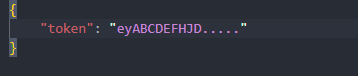

# BlumBot

Very simple bot for Blum that will automatically `claim` daily, friends, `play` games and start farming.

## Install

- Install Python
- Clone or download this repo.

## Setup

- Open Telegram web
- go to the conv with Blum bot
- open the app

If you can't access to the application from your browser you will need to install this extension:

For Firefox [click here](https://addons.mozilla.org/fr/firefox/addon/ignore-x-frame-options-header/)

For Chrome [click here](https://chromewebstore.google.com/detail/ignore-x-frame-headers/gleekbfjekiniecknbkamfmkohkpodhe?pli=1) (i never test it on 
chrome but it should work)

Don't forget to enable it.

We need this extension because the browsers won't display the iframe for security reasons.

- Press `F12` and hover to the `Network` tab to see all requests
- Find the `GET` request '`me`' with a status code of `200`, click on it.
- Check the `request headers` and find the `Authorization` value
  It should look something like this:

    

  And simply copy the token from the value, only the token not the word 'Bearer'

- Add the token to the ``config.json`` file like this:

And now you can start the bot with this command:

`python main.py`
or
`python3 main.py`

